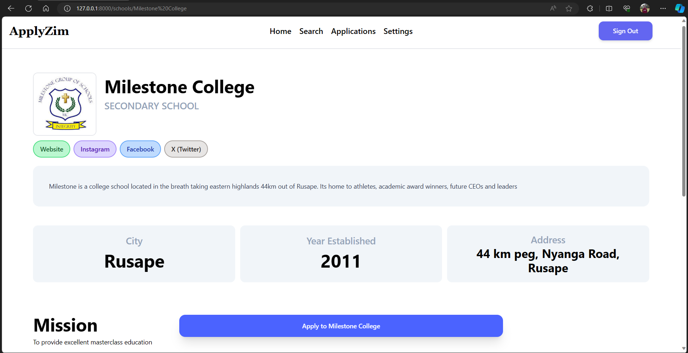

# ApplyZim 

The platform that brings schools and students 

## Purpose?

ApplyZim is a web app that allows students to discorver schools in Zimbabwe and get redirected to the schools application systems.

ApplyZim also allows schools to get discorved by students.

## Stack

1. PHP Laravel

ApplyZim is powered by the Laravel framework as the web framework. [Learn More](https://laravel.com) 

2. SQLite 3 (Development Database)

A lightweight, local, on-file sequel database thats very easy to up, used in Developement

## Still to come

1. Production Database

There is need for a production database that will be used when ApplyZim is launched and made public

2. Docker

Docker will be needed to maximise compatibility so that this app can run on any mission
